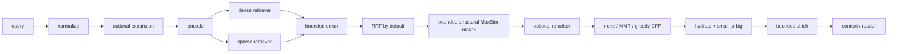

# Retrieval Engine V2

## Purpose

Retrieval Engine V2 adds a typed backend boundary and a measurable retrieval
pipeline without replacing the original RAG3D path. It is opt-in through
`RAG3D_RETRIEVAL_PIPELINE=v2`; `legacy` remains the rollback path.

The central correction to the earlier architecture description is that the
structural signal is a **late-interaction reranker**. It scores only candidates
already generated by dense and sparse retrieval and cannot recover a document
that is absent from their union.

## Runtime flow



Dense and sparse are the only global candidate generators. V2 RRF uses ranks
starting at one, zero contribution for absent documents and equal weights as
the untuned baseline:

```text
RRF(d) = 1/(k0 + rank_dense(d)) + 1/(k0 + rank_sparse(d))
```

The quantum fusion implementation remains available as an experimental V2
choice and as the unchanged legacy default. Raw fusion values are retained in
`fusion_score`; the public final `score=1/final_rank` is ordinal so legacy
memory consumers cannot undo a post-fusion rerank.

## Backend contract

`rag3d.backend.RetrievalBackend` defines storage, dense and sparse retrieval,
structural reranking, hydration, neighbours, lifecycle and health operations.
Each adapter declares a `BackendCapabilities` value. The pipeline checks these
capabilities rather than inferring support from the backend name.

| Capability | SQLite | PostgreSQL holo | pgvector |
| --- | --- | --- | --- |
| Exact dense | yes | no | yes |
| ANN dense | no | holographic/LSH approximation | when a verified HNSW index exists |
| Sparse | yes | yes | yes |
| Structural late rerank | yes | yes | yes |
| Metadata filters | no | no | yes |
| Native vector | no | no | yes |
| Quantized representation | structural float16 | dense int8/binary structural | structural float16 |
| Cross-language index | no backend-wide claim | no backend-wide claim | no |

Cross-language parity is limited to the existing Hash holographic
representation. BGE-M3 and pgvector are Python-only in this change. Node and
Java continue to use the legacy holographic schema. A holographic index with a
V2 fingerprint is mutable only through the Python adapter: Node and Java fail
closed because they cannot validate every V2 chunking/pipeline field. The
portable three-language guarantee therefore applies to a separate legacy Hash
index, not to a V2-certified index.

## Fingerprints

V2 stores canonical JSON plus SHA-256 for every index-affecting choice:

- backend, encoder, model and immutable revision;
- dense and structural dimensions;
- maximum structural tokens and structural projection identity;
- query/passage limits and sparse/schema versions;
- normalization and quantization;
- chunk size, overlap and chunking/pipeline versions.

BGE-M3 is resolved from a fixed Hugging Face commit before FlagEmbedding is
constructed. A changed fingerprint fails closed before a populated index is
used. The historical `encoder=name:dense_dim:structural_dim` metadata key is
preserved for legacy Python/Node/Java compatibility. It is not a substitute
for the full V2 fingerprint, and the non-Python ports refuse a database that
contains the V2 fingerprint sentinel.

The cross-encoder adapter is an optional dependency (`rag3d[reranker]`). It
loads lazily and fails closed to the incoming order. This architectural support
is not evidence of a quality gain; the configured model must be evaluated on a
frozen validation/test protocol.

## Diversity

V2 supports `none`, MMR and greedy DPP after optional reranking. `none` is an
identity operation. MMR keeps maximum similarity incrementally. Greedy DPP
uses shifted cosine, float64, jitter and on-demand kernel columns; it is an
approximation to the fixed-size log-determinant objective, not an exact global
MAP solver.

```text
L = diag(q^alpha) * S * diag(q^alpha)
objective = log det(L_Y), |Y| = k
```

Invalid/missing vectors fall back to the prior order. Pools, text supplied to
rerankers and stitch probes have hard limits. Public queries are capped at
64 KiB of UTF-8 before encoder allocation in Python, Node and Java.

## Diagnostics

Every V2 search returns aggregate timings for normalize, expand, encode,
dense, sparse, union, fusion, structural, rerank, diversity, hydrate, stitch
and totals. Candidate counts are recorded at every stage. Identifiers use
closed allowlists; query text, document text, vectors, secrets and DSNs are not
diagnostic fields.

Structural and reranker outcomes explicitly report `applied`, `skipped` or
`fallback` with a closed reason enum. When any retrieval filter is active,
stitching fails closed because the shared `neighbors` contract cannot prove
that adjacent chunks satisfy the same scope.

## Storage boundaries

The pgvector schema uses only `rag3d_v2_*` tables and does not modify `holo_*`.
The runtime never executes `CREATE EXTENSION`; extension installation is an
administrator operation. Base schema migration and HNSW build are separate so
HNSW parameters can be measured rather than baked into a universal default.

The holographic adapters do add and validate three named foreign keys over the
existing `holo_*` columns. They prevent orphan documents, parents and sparse
postings. This is additive DDL, but validation can scan existing tables and
fails closed on orphaned or incompatible legacy data. Bootstrap runs in a
transaction with finite lock/statement timeouts; rollout still requires the
documented read-only orphan preflight and a coordinated maintenance window.

Dense mode is explicit: `exact` is the default ground truth; `ann` requires a
verified HNSW catalog entry and natural HNSW plan or fails; `auto` may fall back
to exact and records the mode actually used. Search statements use bounded,
transaction-local timeouts and HNSW settings.

## Known limits

- Structural reranking and any cross-encoder can only reorder their bounded
  candidate pool.
- HNSW use is a PostgreSQL planner decision and must be confirmed with the
  provided EXPLAIN/benchmark tooling for the target corpus and filters.
- Hash-only synthetic evaluation is a regression/performance harness, not
  evidence that the method generalizes to BEIR or a production corpus.
- JavaScript and Java do not implement the V2/pgvector pipeline in this PR.
- Node/Java cannot open a V2-certified holographic index; use a synchronized
  legacy Hash index for cross-language traffic.
- Ingestion is bounded to 16 MiB/512 chunks with embedding batches of 32.
- The feature flag changes code paths, not data placement. Immediate rollback
  requires a synchronized legacy index; there is no cross-backend dual write.

See the [ADR](../adr/0001-retrieval-engine-v2.md),
[rollout guide](../guides/retrieval-v2-rollout.md) and
[rollback guide](../guides/retrieval-v2-rollback.md).
