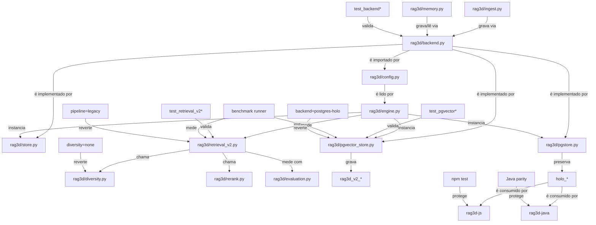

# Grafo de impacto

Este grafo será atualizado a partir do diff final. Arestas indicam consumidores,
interfaces afetadas, testes e rollback; tabelas holográficas compartilhadas não
são alteradas.

| Área | Dependência anterior | Consumidor | Risco | Proteção | Rollback |
| --- | --- | --- | --- | --- | --- |
| Contratos | duck typing implícito | engine, ingest, memory, retriever | abstração excessiva | Protocol estrutural + contract tests | código legacy continua aceito |
| Configuração | DSN decide backend | CLI e `TriRag` | precedência/fallback | unitários de matriz de ambiente | remover flags e usar legado |
| SQLite | schema local | API Python | regressão offline | smoke + contract + reopen | `pipeline=legacy` |
| postgres-holo | `holo_*` compartilhado | Python/Node/Java | regressão cross-language | nenhum DDL destrutivo + parity | `backend=postgres-holo` |
| pgvector | novo namespace | V2 Python | planner/filtro/migration | PG real, exact ground truth, EXPLAIN | parar profile/backend |
| Pipeline V2 | recuperadores atuais | `search`, reader, memory | perda de recall | recall por estágio + flag | `pipeline=legacy` |
| Diversidade | DPP legado | top-k final | nDCG/MRR | `none` identidade + ablação | `diversity=none` |
