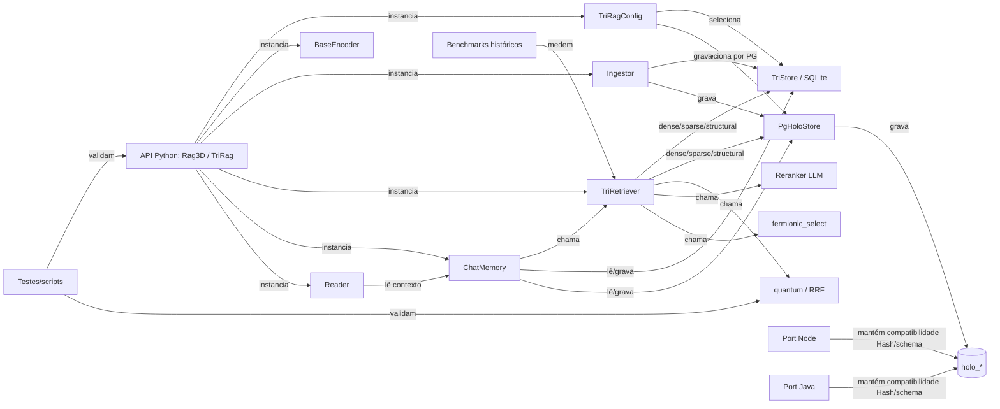

# Grafo do repositório

O grafo usa arestas observadas no código-base; documentação não é usada para inferir chamadas ausentes.

## Relações sensíveis

| Origem | Aresta | Destino | Risco |
| --- | --- | --- | --- |
| `engine.py` | instancia | store/encoder/retriever | alto: escolha de backend e fingerprint |
| `ingest.py` | grava | schemas SQLite/holo | alto: atomicidade e paridade |
| `retrieve.py` | chama | dense/sparse/structural/fusion | alto: recall e ordem pública |
| `holo.py` | implementa | bytes portáveis | alto: cross-language |
| `fusion.py` | mede/ordena | hits finais | alto: determinismo |
| Node/Java | compartilha | `holo_*` | alto: schema/encoder |
| `memory.py` | depende de | `TriResult` | médio: retrieval-only/contexto |
