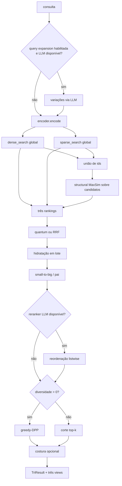

# Grafo do retrieval atual



O nó estrutural é um **late-interaction reranker**: suas consultas SQL/SQLite usam apenas ids da união. A view “estrutural” é independente como apresentação, mas não como geração global de candidatos.

## Decomposição a instrumentar

```text
T_total = T_normalize + T_expand + T_encode + T_dense + T_sparse
        + T_union + T_fusion + T_structural + T_rerank
        + T_diversity + T_hydrate + T_stitch + T_reader
```

O código-base não mede esses termos separadamente. Qualquer paralelismo dense/sparse deve comparar `max(T_dense,T_sparse)+overhead` com a soma sequencial e respeitar conexões/thread-safety.
