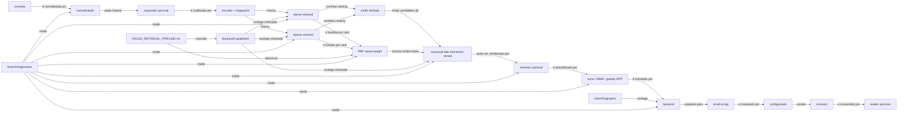
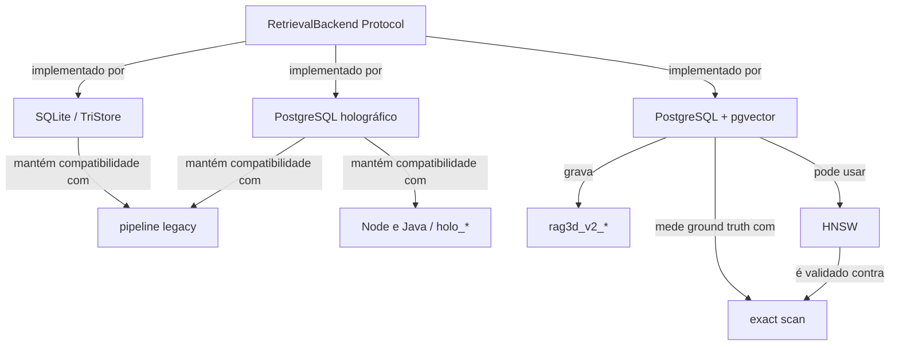

# Grafo da Retrieval Engine V2

O grafo alvo é `G=(V,E)`. Nós representam configuração, estágio, backend,
métrica e invariante; arestas nomeiam a relação executável. RRF recebe somente
rankings de recuperadores independentes. O canal estrutural é uma interação
tardia limitada e não pode introduzir um documento ausente da união.

## Backends e capabilities

Rollback global: `RAG3D_RETRIEVAL_PIPELINE=legacy`. Rollbacks de estágio são
`RAG3D_STRUCTURAL_RERANK=false`, `RAG3D_RERANKER=none` e
`RAG3D_DIVERSITY_METHOD=none`.
