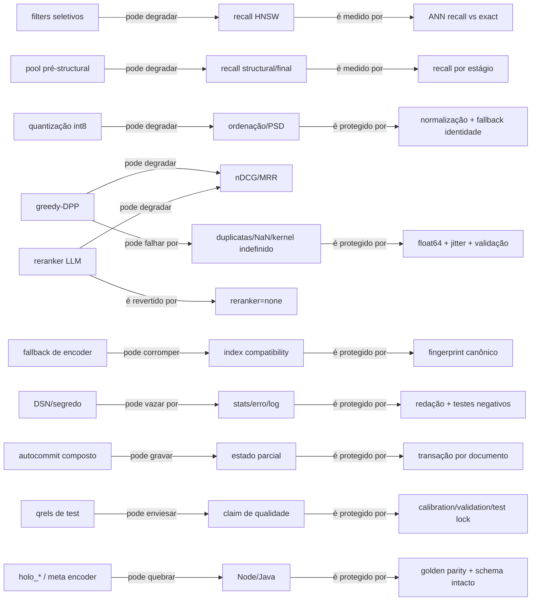

# Grafo de riscos

| Risco | Probabilidade | Impacto | Evidência atual | Gate | Rollback |
| --- | --- | --- | --- | --- | --- |
| HNSW com filtro devolve menos que `k` | alta | alta | filtro ocorre durante scan aproximado | quatro seletividades + exact | exact ou holo/SQLite |
| fingerprint insuficiente mistura índices | alta | alta | chave atual tem só três campos | mismatch tests | legacy/reindex |
| fallback silencioso troca BGE por Hash | alta | alta | factory captura exceções amplas | flag explícita | Hash explícito ou legacy |
| transação PostgreSQL parcial | alta | alta | autocommit por statement | fault injection | adapter anterior |
| DPP instável/claim MAP incorreto | média | alta | eco int8 pode gerar kernel indefinido | PSD/jitter/property tests | `none`/MMR |
| DSN em stats/erro | alta | alta | API atual devolve valor cru | redaction tests | saída sanitizada |
| tuning/leakage no test | alta | alta | `--max_docs` lê qrels antes do corpus | config/checksum lock | sem claim |
| regressão cross-language | média | alta | schema/meta compartilhados | Node+Java golden | legacy/holo |
| threads sem ganho | média | média | teto Amdahl observado 3,69% | não implementar | sequencial |
| benchmark sintético generalizado | alta | alta | scripts históricos são controlados | claim scope explícito | meta não atingida |
